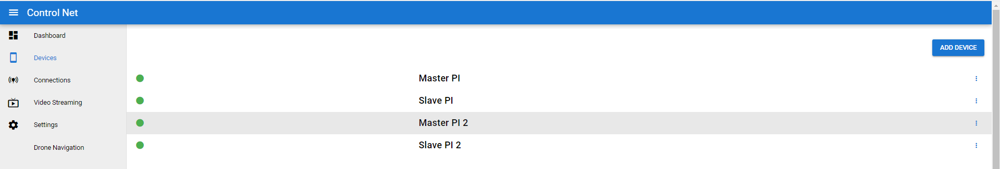
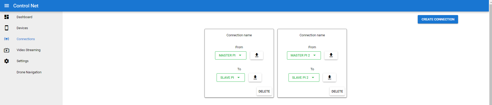

# Client Configuration

### To be known words

#### Device
 A unique ior-client process, that runs on the client device. These devices are seperated by unique device code in the given user context.

#### Connection
 A connection is connectivity bridge between 2 clients, managed by the IOR-SocketServer. Before the target devices connect to server, a connection has be specified on the server side to get it to work.

### Connection Config

After cloning this [repository](https://github.com/mayank31313/ior-python), the directory structure is a follows

    ./ior-python
        /config
            /from.json
            /from2.json
            /to.json
            /to2.json
            /iorConfigs.config

These are the client connection config that are required by every client that connects to the IOR-SocketServer, and are very important. These files contains server and client related configs. These files can also be downloaded through Controlnet Frontend from connections section.

But by default, these configuration files can be used to Quick Start the client application. Other than that iotConfig.config file is not the connection configuration, but has some external configuration that can be used by IOR Client.

### Lets go

In this section we will create a and understand, how the connectivity and connection works in a device.

When a socket server instance is created, it also creates a default user at the server side along with some devices and connections listed below:

* Device 1 - Master 1 (type = Raspberry Pi)
* Device 2 - Slave 1 (type = Raspberry Pi)
* Device 3 - Master 2 (type = Raspberry Pi)
* Device 4 - Slave 2 (type = Raspberry Pi)

Master 1,2 and Slave 1,2 are just device name given, it doesn't mean that the only master can control the slave. The communication is bidirectional.

After creating a device, the devices will not pair up to each other automatically, we will need to specify a connection between those. See below image. There are 2 connections already created

* Connection 1: Master 1 <--> Slave 1
* Connection 2: Master 2 <--> Slave 2

After creating a connection, users can download the configuration file for each connecting device from the download button. These are required and important file, as they store client configurations.

In the [above section](#connection-config), we specified json files, these are the same connection file which store client configuration.

* from.json = Master 1
* to.json = Slave 1
* from.json = Master 2
* to.json = Slave 2

These json files also help socket-server to authenticate. 

## Whats Next

There is more content to add.